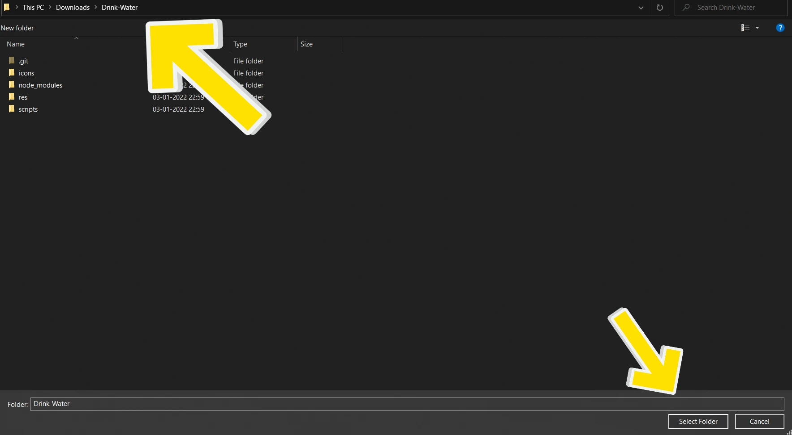

# Drink-Water
This is a Chrome extension which reminds you to `Drink Water` at your specified time.

It is important to drink water at regular intervals, especially when working or studying. Thus, I have created this extension to remind users to drink water at their own optimum intervals.

Users can use this either as a water interval timer or even a stopwatch if they want to.

This is a FOSS and a simple extension. Have fun and **Drink Water !**

# How to Use ?
Install the extension using the instructions given below.

`Pin` the extension if not done so already.

Now, click the extension. 

<p align="center">
  
</p>
  
Here, you can set the time and click on Save.

When you reopen the extension the timer would have been set to your preference !

<p align="center">
  
</p>

Then extension will now have this icon when the timer expires and it wants you to Drink Water !


<p align="center">
  
</p>

# Installation Instructions
**Step 1:** Clone the contents of this repository as using `git clone git@github.com:ShabarishRamaswamy/Drink-Water.git`

Or Download the Zip using:


<br />

**Step 2:**
Go to your respective browsers' extension page.
This might be in settings->extensions.

It should look something like this:


<br />

**Step 3:**
Click on the `Load Unpacked` button:


<br />

**Step 3**:
Unzip the contents if you have downloaded as a Zip file.

If you don't have an unzipper then I suggest using <a href="https://github.com/peazip/PeaZip">PeaZip</a>. It is Free and Open Source.

<br />

**Step 4:**
Navigate to the folder in which you have downloaded:


<br />

**Step 5:**
Click on `Select Folder`.



<br />

**Step 6:**
Enjoy 😎 

<br />

# Folder Structure
```
Drink-Water
│   README.md
│   background.js
│   package.json    
│   LICENSE    
│
└───res/fonts
│   │   Fonts
│   │
│   
└─── scripts
    │   popup.js
    │   popup.html
    │   popup.css
|
|
└─── icons
```

# Contents
`package.json` - Contains information about the development packages such as auto completion using @types module.

`manifest.json` - The entry point of any Browser Extension. Contains mission critical information such as the `manifest version` and other information pertaining to `background scripts` and `content scripts`.

`background.js` - The main service worker which constantly runs in the background. This is the backbone of the extension.

`popup.js` - This is the popup javascript code, popups are the menus that drop down when you click the extension icon on the top right of your browser.

# Supported Browsers
1. Brave - Latest.
1. Chrome - Latest.
1. Edge - Latest.
1. Opera - Latest.

Basically any latest chromium based browsers.

My Recommendation: `Brave`.

# Unsupported
1. Firefox - Due to Privacy Reasons, Firefox does not support Manifest Version 3.

# Progress
- [x] Initial Setup.
- [x] Message Passing.
- [x] Main Timer that constantly runs in the background.
- [x] Saving user preference and timer information.
- [x] Initial Timer - Digital timer.
- [ ] Rest of the Timers - Analog, Tank and Pomodoro.
- [x] Improve UI and UX.